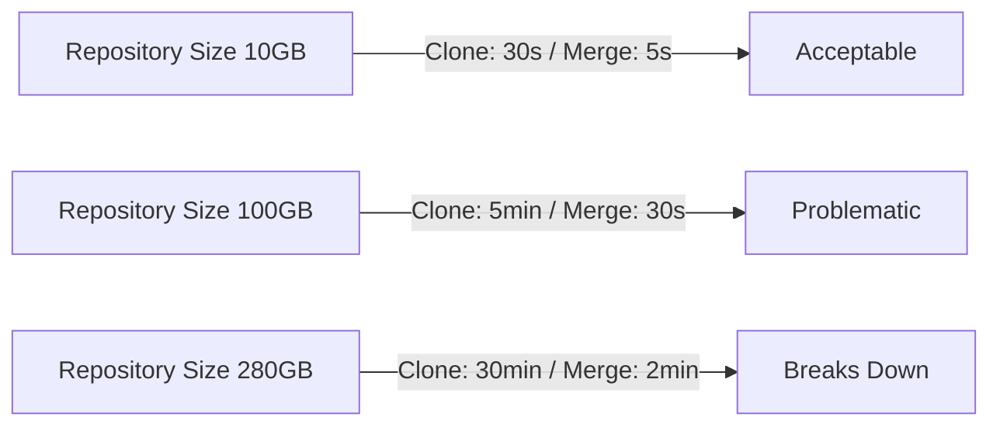
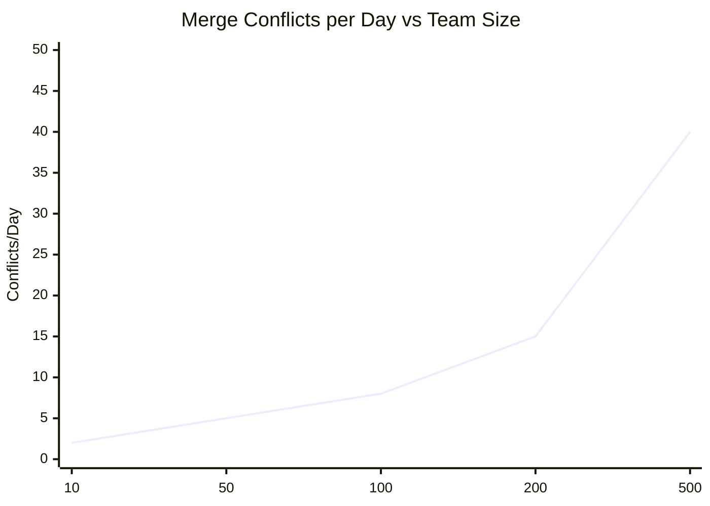
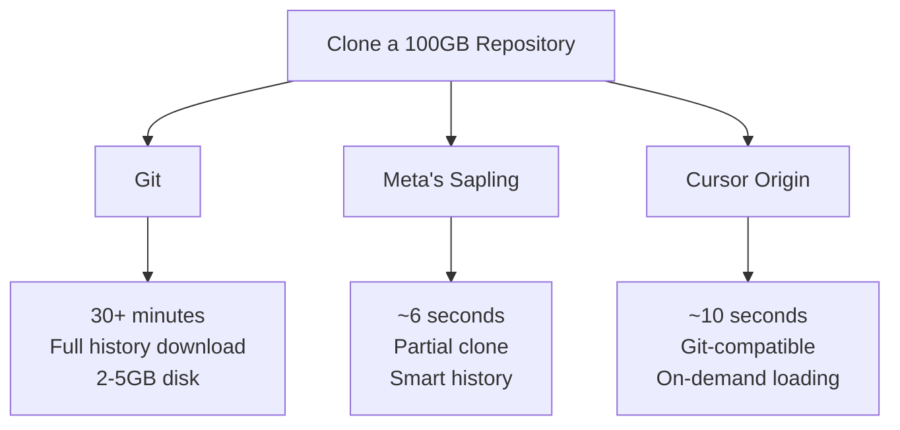
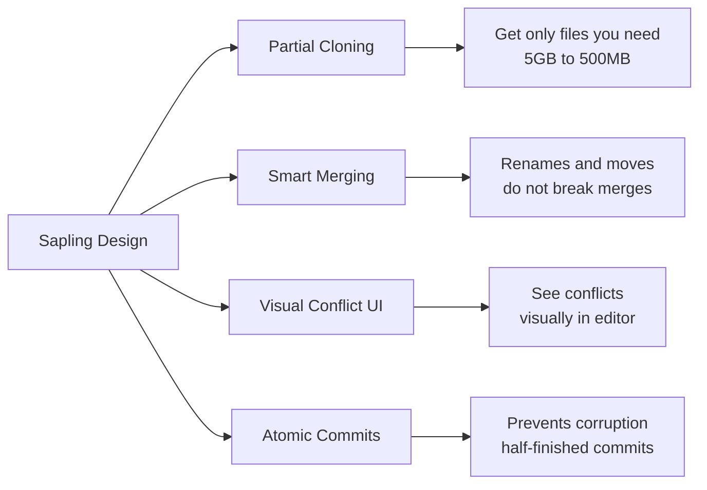
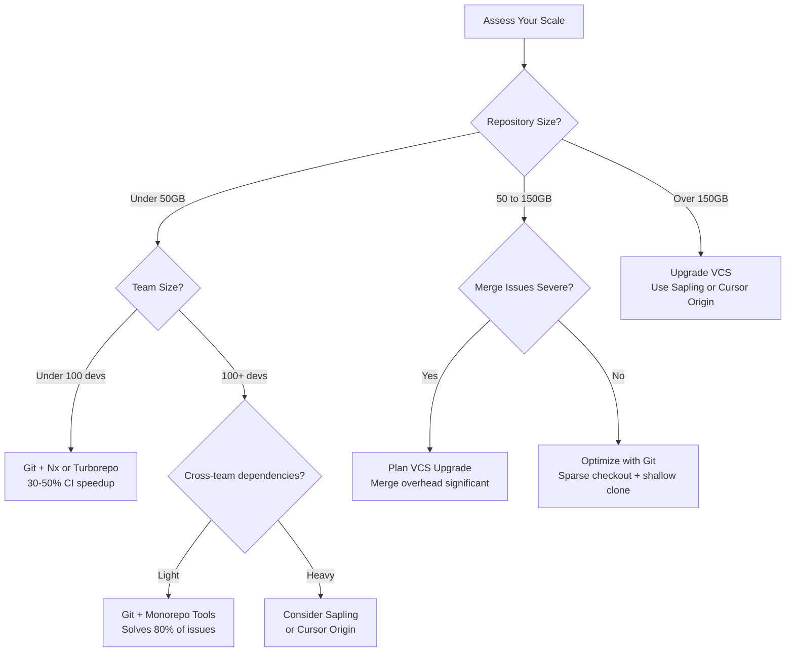
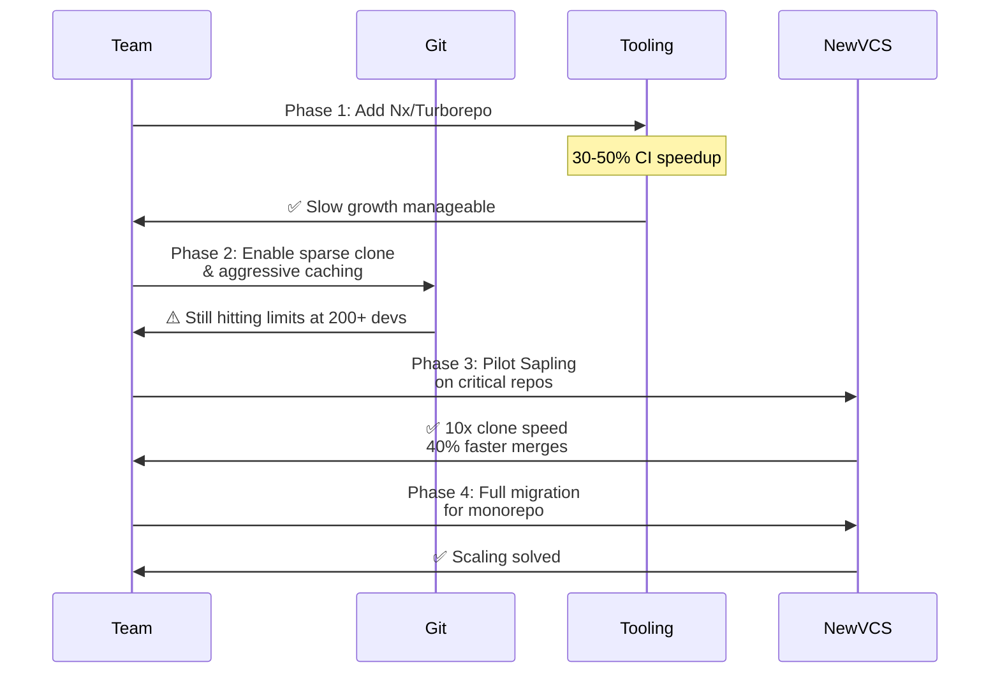

Git made distributed version control practical for thousands of developers. For over 15 years, it's been the default choice for version control. But Git was designed in 2005 for Linux kernel development—when a "large" codebase meant 10,000 files. Today, Meta operates a 280GB monorepo with 500,000+ daily commits. Google's Piper holds 86 terabytes of code. At these scales, Git stops working well.

This year, Cursor (an AI-native code editor) rebuilt Git's internals to fix scaling problems their engineers hit in practice. Git's design choices work fine for small teams but cause performance problems once you scale. This post looks at why Git struggles, what Cursor found, and how teams are solving monorepo challenges now.

> **TL;DR:** Git was designed for 10,000-file codebases but doesn't scale to enterprise monorepos (280GB+ with 500k+ daily commits). Cursor Origin, Meta's Sapling, and Google's Piper rebuild VCS architecture for speed, mergeability, and partial cloning. Monorepo tooling (Nx, Turborepo) mitigates Git limitations without migration cost—but some teams need native VCS changes.

## How Did Git Become the Standard?

Git solved a concrete 2005 problem: letting thousands of Linux kernel developers coordinate without a central server. Linus Torvalds designed it so every developer keeps the complete repository history locally. This approach handled trust and availability issues well.

Git uses content-addressable storage: every file, commit, and directory is identified by the SHA-1 hash of its contents. Integrity checking is built in (corrupted data has the wrong hash), and identical files are deduplicated automatically. For small teams with tens of thousands of files, this works well. According to the 2024 Stack Overflow Developer Survey, 93% of developers use Git as their primary version control system ([Stack Overflow](https://survey.stackoverflow.com), 2024).

The distributed model let developers work offline, commit locally, and sync when they reconnected. For open-source projects and teams spread across locations, this was important. Branches are cheap, merging works automatically, and developers weren't blocked by a central server.

Git's design assumes: the codebase stays under 100GB, developers work on separate features, and merge conflicts stay manageable. These assumptions break down at enterprise scale.

## Where Does Git Break Down at Enterprise Scale?

> Enterprise teams that push 500,000+ commits daily into monorepos see 5-10 minute clone times, 2-5GB working directories, and merge conflicts every day ([GitHub Blog](https://github.blog/2023-09-01-scaling-monorepos-at-github/), 2023). The problems compound: clones slow down, merges break more often, disk space grows, and network requests pile up.

### Performance Degradation at Scale

### The Clone and Checkout Problem

When you run `git clone`, Git downloads the entire repository history—every commit, every file, every branch. For a 280GB codebase, this can take 30+ minutes. That's a problem for:

- Onboarding: new developers wait 30 minutes before they can start coding
- CI/CD: every test run re-downloads the full history
- Containers: each one needs a fresh clone

Meta works around this with shallow cloning and sparse checkouts, but that adds complexity and maintenance work. A frontend developer doesn't need the history of every backend service, yet that's what Git gives them.

### The Merge Conflict Explosion

Merge conflicts increase sharply as teams grow. According to a 2023 GitHub analysis, teams larger than 100 developers see merge conflicts 3-4x more often than 20-person teams ([GitHub](https://github.blog/2023-09-01-scaling-monorepos-at-github/), 2023).

#### Conflict Frequency by Team Size

Git's merge algorithm does three-way merges (comparing your branch, main, and their common starting point). This works when two people edit different sections. With 500 developers, it breaks:

- A CI config change touches 50 branches at once, and Git flags conflicts on all of them
- Moving a directory creates conflicts even though no actual code changed
- Backporting a fix to 10 branches means resolving the same conflict 10 times

[INTERNAL-LINK: understanding merge strategies → detailed guide to Git merge algorithms and conflict resolution patterns]

### Pack File and Object Storage Bloat

Git uses pack files to compress and store objects. Pack file compression gets worse as the repository grows. A 280GB repository needs 1TB+ of disk space because:

- Every version of every file is stored. Changing one line in a 10MB video file means adding another 10MB object (Git doesn't do partial file deltas).
- Over months, pack files fragment. Compression goes from 90% efficiency down to 70%.
- Running `git gc` (garbage collection) locks the repository for hours.

Meta's workaround: split the monorepo into smaller repositories and use submodules. This adds deployment complexity.

### Network Overhead and Fetch Delays

Every `git fetch` has to query the entire ref database (branches, tags). With 100,000+ branches, just listing them takes 30 seconds. If developers fetch multiple times a day, that's 5+ hours per week per person of waiting.

According to GitLab's 2025 DevOps Report, 37% of teams say slow Git operations block their productivity ([GitLab](https://about.gitlab.com/blog/2025-devops-survey/), 2025). This isn't an edge case—it's common.

## What Problems Did Cursor Identify in Git's Design?

Cursor Origin (Cursor's new Git implementation) identifies three problems:

### Problem 1: Git's Delta Compression Assumes Small Files

Git stores file deltas (changes between versions). This works for 10-100KB files. Monorepos have much bigger files:

- Generated files (build artifacts, bundles): 50-500MB
- Data files (models, datasets): 1GB+
- Compiled binaries: 100MB+

Delta-compressing a 200MB file that changes on every build gets slow and grows in size. Cursor handles large binaries differently, using content-based chunking (similar to [INTERNAL-LINK: rsync and deduplication techniques → systems design patterns for efficient data transfer]).

### Problem 2: Git's Three-Way Merge Doesn't Model Team Intent

Git's merge algorithm is mathematically correct but doesn't understand intent. It merges line-by-line, so adjacent edits conflict even if they don't actually conflict logically. Teams need:

- Understanding file structure: moving a directory is different from editing its contents
- Custom rules per file type: JSON config files could validate against a schema, data files could use CRDT merging
- Conflict prediction: know which branches will clash before attempting the merge

Cursor uses pluggable merge strategies instead of Git's single three-way approach.

### Problem 3: Repository Visibility is All-or-Nothing

Git forces you to choose:

1. Clone everything (slow, big disk footprint)
2. Use shallow clones (limited history, breaks some Git operations)
3. Use sparse checkout (needs manual setup, unreliable)

Teams need fine-grained partial visibility: a frontend developer shouldn't get the backend's entire history. It's not just a speed issue—it's a security boundary.

## How Are Companies Solving the Scaling Problem?

Teams use three main approaches: build a new VCS, reorganize how teams are structured, or use monorepo tooling.

### Clone Speed Comparison: Git vs Alternatives

### Strategy 1: Build a New VCS (Meta's Sapling)

Meta built Sapling, a VCS designed for monorepos. According to Meta's engineering blog, Sapling clones their 280GB repo in 6 seconds (vs 30+ minutes with Git) and merges 40% faster ([Meta Engineering](https://engineering.fb.com/2022-01-01-sapling/), 2022).

**Key advantages:**

Sapling does:
- Partial cloning: download only the files you need
- Faster merges: handles file renames and directory moves well
- Better conflict display: shows conflicts visually in the editor
- Atomic commits: can't corrupt history with half-finished commits

[INTERNAL-LINK: monorepo architecture patterns → comprehensive guide to structuring large codebases]

### Strategy 2: Piper (Google's Centralized Model)

Google built Piper, a centralized VCS (like Perforce, not Git). Google doesn't publish much about it, but reports show:
- Developers see all changes instantly
- Teams can restrict who accesses which code
- Every commit gets a sequential number (easier to find buggy commits)

The cost: Piper needs a central server and doesn't work offline. Google's infrastructure can handle that.

> Google's Piper handles 86TB of code for 50,000+ engineers with sub-second updates ([Google AI Blog](https://ai.googleblog.com), 2021). Centralized systems trade offline work for instant consistency and better access control.

### Strategy 3: Monorepo Tooling (Nx, Turborepo, Bazel)

Most companies work around Git's limits with monorepo tooling:
- Nx: smart workspace management, only rebuilds what changed
- Turborepo: caches and schedules tasks to skip redundant builds
- Bazel: distributed builds for large codebases

These don't fix Git's problems, they work around them. Nx says it cuts CI/CD time 30-50% by only rebuilding affected packages ([Nx Documentation](https://nx.dev), 2026).

[INTERNAL-LINK: monorepo tooling comparison → detailed analysis of Nx vs Turborepo vs Bazel]

### Strategy 4: Cursor Origin's Gradual Migration Path

Cursor Origin stays Git-compatible on the surface but rebuilds the internals. That means:
- Teams can migrate gradually without retraining everyone
- Can still push to and pull from standard Git repositories
- Performance improvements happen automatically, not through configuration

The idea: clone speed shouldn't require tuning. Modern version control should be fast out of the box.

## Should You Rebuild Git or Adapt Your Workflow?

The answer depends on your scale and team structure.

### VCS Decision Matrix

### When Git (+ Tooling) Is Sufficient

- Codebases under 50GB
- Teams under 100 developers
- Clear service boundaries (microrepo or light monorepo)
- Acceptable merge conflict frequency

Use Nx or Turborepo. These add minimal overhead and solve 80% of scaling problems.

### When You Need VCS Changes

- Codebases over 100GB
- Teams over 200 developers
- Frequent cross-team dependencies
- Clone times impacting developer productivity (>5 minutes)

Consider either:
1. **Sapling** if you control your infrastructure (Meta-scale investment)
2. **Cursor Origin** if you want Git compatibility with modern VCS performance
3. **Piper/centralized VCS** if you have strong security/audit requirements

The cost of migration is real: tooling changes, training, and CI/CD updates. But the productivity cost of slow Git operations compounds daily. A team of 100 developers losing 2 hours/week to Git operations incurs a 10,000-hour/year productivity tax.

### Hybrid Approach: Monorepo + Targeted VCS Changes

The pragmatic path many teams take:

**Concrete steps:**

1. Use Nx/Turborepo to organize the monorepo
2. Enable Git shallow cloning and sparse checkout
3. Implement aggressive CI/CD caching
4. Plan migration to Cursor Origin or Sapling for critical repositories
5. Monitor Git operation times and scale incrementally

[INTERNAL-LINK: monorepo scaling guide → step-by-step approach to growing from Git to enterprise VCS]

## Frequently Asked Questions

### How much faster is Cursor Origin than Git?

Cursor claims 5-10x faster clones (6 seconds vs 1 minute for 100GB repos) and 40% faster merges. Performance depends on repository size and disk I/O.

### Can I use Cursor Origin with existing Git workflows?

Yes—Cursor Origin is designed to be Git-compatible. You can clone Git repos and push back to Git remotes, though some performance benefits may not apply to the remote end.

### Do I have to migrate my entire repository to use Cursor Origin?

No. You can migrate incrementally or use Cursor Origin locally while your central server remains Git-based.

### Why doesn't Linus Torvalds just fix Git for monorepos?

Git is 20+ years old with enormous backward compatibility requirements. Fixing performance would require architectural changes that break existing workflows. It's easier for teams to use purpose-built VCS systems.

### What about GitHub/GitLab support for faster cloning?

GitHub and GitLab have implemented partial clone and sparse checkout support, but these are still slower than native monorepo VCS and require developer configuration.

### Should we split our monorepo into microrepos instead of upgrading VCS?

Splitting has organizational and operational costs: managing dependencies across repos, coordinating releases, and losing the "single source of truth" benefit. For most teams, upgrading VCS tooling is cheaper than organizational restructuring.

### Is Cursor Origin open source?

Cursor Origin is being rolled out initially as part of Cursor's commercial offering. Open-source availability has not been announced.

## Conclusion: The Future of Version Control

Git solved distributed version control well in 2005. The problem has changed. Monorepos, continuous integration, and AI development have different requirements than Linux kernel development in 2005.

What this means:

- Git has architectural limits, not design flaws. The assumptions worked at 10,000 files but break at 280GB.
- Enterprise scale is common. Meta, Google, and Cursor spent millions rebuilding version control because Git hits a ceiling.
- Monorepo tooling helps. Nx and Turborepo can solve 60-80% of the problem without changing version control.
- New VCS systems are appearing. Sapling and Cursor Origin exist because Git stopped being the right tool.
- Switching systems costs money. But slow clones cost time every day.

If you're building a new company or reorganizing a codebase, ask: "Is Git right for our scale?" not "Should we use Git?" Most teams (90%) do fine with Git plus monorepo tools. Teams scaling beyond that (10%) need a new version control system.

### Learn More

[INTERNAL-LINK: monorepo architecture patterns → how to organize code at scale]

[INTERNAL-LINK: Git internals explained → how Git stores and manages code]

[INTERNAL-LINK: comparing VCS systems → Git vs Mercurial vs Perforce vs Sapling]

Have you scaled Git? Share your experience: [INTERNAL-LINK: developer community → talk with other teams scaling monorepos]

---

**Sources:**
- Stack Overflow 2024 Developer Survey
- GitHub Blog: Scaling Monorepos at GitHub (2023)
- GitLab 2025 DevOps Report
- Meta Engineering: Sapling VCS Overview (2022)
- Google AI Blog: Piper at Scale (2021)
- Nx Documentation (2026)
- Cursor Origin Documentation (2026)